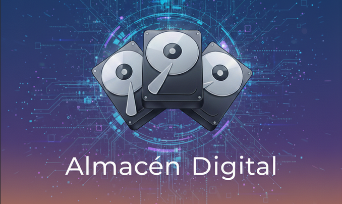

# Almacén Digital / Digital Storage Catalog

> **🇪🇸 [Versión en Español](#español) | 🇺🇸 [English Version](#english)**

---

## English

[](https://www.python.org/downloads/)
[](https://www.riverbankcomputing.com/software/pyqt/)
[](docs/)
[](docs/COMPLETION_SUMMARY.md)
[](docs/LICENSE)

A powerful desktop application to catalog and search files across multiple external hard drives and storage devices. Built with PyQt6, featuring a sleek dark interface and real-time connection status indicators.

### ✨ Key Features

**Core Functionality**
- 📦 **Smart Cataloging** - Index all files and folders from external drives
- 🔍 **Instant Search** - Find files across all drives in milliseconds
- 💾 **Offline Access** - Search your catalog even when drives are disconnected
- 📊 **Rich Visualizations** - Charts and graphs for storage analysis
- 🔄 **Auto-Update** - Connection status updates every 10 seconds
- ⚡ **Background Scanning** - Non-blocking drive indexing with progress bar
- 📤 **Background Export** - Non-blocking Excel export with progress indicators
- 🎨 **Dark Theme** - Professional interface

**Connection Status Indicators 🆕**
- **Blue circle (●)** - Drive currently connected
- **Gray circle (●)** - Drive disconnected
- Real-time updates in Inventory and Manage views

### 🚀 Quick Start

**For Users (Standalone Executable)**

See releases section for download links for Windows, macOS, and Linux.

**For Developers (From Source)**

```bash
# Clone repository
git clone https://github.com/ogrgijon/almacen_digital.git
cd almacen_digital

# Install dependencies
# Windows
install.bat

# Linux/macOS
chmod +x install.sh
./install.sh

# Run application
# Windows
scripts\run.bat

# Linux/macOS
./scripts/run.sh
```

### 📖 Documentation

Complete documentation available in **English** and **Spanish**:

- **[User Guide (English)](docs/en/USER_GUIDE.md)** / **[Guía del Usuario (Español)](docs/es/GUIA_USUARIO.md)**
- **[Development Guide (English)](docs/en/DEVELOPMENT_GUIDE.md)** / **[Guía de Desarrollo (Español)](docs/es/GUIA_DESARROLLO.md)**
- **[Building Guide (English)](docs/en/BUILDING_GUIDE.md)** / **[Guía de Construcción (Español)](docs/es/GUIA_DESPLIEGUE.md)**

### 🔧 Requirements

- Python 3.9+
- Windows/macOS/Linux
- 100MB free disk space
- External drives (USB, HDD, SSD, Network)

### 📄 License

Creative Commons Attribution-NonCommercial 4.0 International (CC BY-NC 4.0) - See [LICENSE](LICENSE) for details.

### 📋 Important Documents

- **[License](LICENSE)** - Usage terms and conditions
- **[Security Policy](SECURITY.md)** - Vulnerability reporting
- **[Code of Conduct](CODE_OF_CONDUCT.md)** - Community guidelines
- **[Contributing](CONTRIBUTING.md)** - How to contribute
- **[Changelog](CHANGELOG.md)** - Version history
- **[Disclaimer](DISCLAIMER.md)** - Important legal notices

### 🙏 Credits

**Created by:** [OGRGijon](https://www.linkedin.com/in/ogrgijon)

Built with ❤️ using Python and PyQt6

### 📞 Support

- Issues: [GitHub Issues](https://github.com/ogrgijon/almacen_digital/issues)
- Documentation: [docs/](docs/)
- Contact: [LinkedIn - OGRGijon](https://www.linkedin.com/in/ogrgijon)

---

## Español

---

## Español

[](https://www.python.org/downloads/)
[](https://www.riverbankcomputing.com/software/pyqt/)
[](docs/)
[](docs/COMPLETION_SUMMARY.md)
[](docs/LICENSE)

Una potente aplicación de escritorio para catalogar y buscar archivos en múltiples discos duros externos y dispositivos de almacenamiento. Construida con PyQt6, cuenta con una interfaz oscura e indicadores de estado de conexión en tiempo real.

## ✨ Características Principales

### Funcionalidad Principal
- 📦 **Catalogación Inteligente** - Indexa todos los archivos y carpetas de discos externos
- 🔍 **Búsqueda Instantánea** - Encuentra archivos en todos los discos en milisegundos
- 💾 **Acceso Offline** - Busca en tu catálogo incluso cuando los discos están desconectados
- 📊 **Visualizaciones Ricas** - Gráficos y diagramas para análisis de almacenamiento
- 🔄 **Actualización Automática** - Estado de conexión se actualiza cada 10 segundos
- ⚡ **Escaneo en Segundo Plano** - Indexación de discos sin bloqueo con barra de progreso
- 📤 **Exportación en Segundo Plano** - Exportación a Excel sin bloqueo con indicadores de progreso
- 🎨 **Tema Oscuro** - Interfaz profesional

### Indicadores de Estado de Conexión 🆕
- **Círculo azul (●)** - Disco actualmente conectado
- **Círculo gris (●)** - Disco desconectado
- Actualizaciones en tiempo real en las vistas Inventario y Gestionar

## ⚠️ Descargo de Responsabilidad

**IMPORTANTE:** Lea atentamente este descargo de responsabilidad antes de usar Almacén Digital.

### Uso del Software
- **Uso bajo su propio riesgo**: Este software se proporciona "tal cual", sin garantías de ningún tipo, expresas o implícitas.
- **Responsabilidad del usuario**: El usuario es el único responsable del uso correcto de esta aplicación y de las consecuencias derivadas de su uso.
- **No hay garantías**: No se garantiza que el software esté libre de errores, sea adecuado para un propósito específico, o funcione sin interrupciones.

### Gestión de Datos
- **Respaldo de datos**: Se recomienda encarecidamente hacer copias de seguridad regulares de sus datos antes de usar esta aplicación.
- **Pérdida de datos**: El desarrollador no se hace responsable por pérdida, corrupción o daño de datos que pueda resultar del uso de esta aplicación.
- **Archivos del sistema**: No use esta aplicación para escanear o modificar archivos críticos del sistema operativo.

### Limitaciones Técnicas
- **Compatibilidad**: La aplicación ha sido probada principalmente en Windows. El uso en otros sistemas operativos puede tener limitaciones.
- **Hardware**: Algunos discos duros pueden no ser compatibles con las funciones de monitoreo S.M.A.R.T.
- **Rendimiento**: El rendimiento puede variar dependiendo del hardware, número de archivos y configuración del sistema.

### Aspectos Legales
- **Licencia**: Este software está licenciado bajo Creative Commons Attribution-NonCommercial 4.0 International.
- **Uso comercial**: No se permite el uso comercial sin autorización expresa del desarrollador.
- **Propiedad intelectual**: Todos los derechos de propiedad intelectual pertenecen al desarrollador original.

### Soporte y Contacto
- **Sin soporte oficial**: Este proyecto se proporciona sin soporte técnico oficial garantizado.
- **Comunidad**: Para preguntas, use los issues de GitHub o contacte al desarrollador directamente.
- **Actualizaciones**: Las actualizaciones se proporcionan cuando están disponibles, sin compromisos de tiempo.

**Al usar esta aplicación, usted acepta todos los términos de este descargo de responsabilidad.**

## ⚙️ Opciones de Configuración

Accede a configuraciones completas a través del botón **⚙️ Configuración** en la barra superior:

### 🔄 Sincronización
- **Sincronización multi-equipo** - Comparte bases de datos entre dispositivos vía almacenamiento en la nube
- **Rutas de respaldo** - Configura carpetas sincronizadas
- **Direcciones de sincronización** - Bidireccional, desde respaldo, o hacia respaldo
- **Sincronización automática** - Al inicio y/o cierre de la aplicación

### 🎨 Interfaz
- **Tamaño de ventana** - Personaliza las dimensiones predeterminadas de la aplicación
- **Tema** - Tema oscuro (temas adicionales planificados)

### 🔍 Escaneo
- **Profundidad de escaneo** - Controla la profundidad de recursión de carpetas (-1 para ilimitado)
- **Carpetas excluidas** - Omite carpetas del sistema y directorios temporales

### 🔎 Búsqueda
- **Retraso de debounce** - Ajusta el retraso de entrada de búsqueda (ms)
- **Máximo de resultados** - Limita resultados de búsqueda por rendimiento

### 📤 Exportación
- **Exportación Excel** - Exporta base de datos completa a formato XLSX
- **Hojas estructuradas** - Índice de discos + jerarquías de carpetas individuales
- **Control de profundidad de carpetas** - Selecciona nivel máximo de carpeta a exportar (solo raíz, hasta nivel 1-10, o todo)
- **Procesamiento en segundo plano** - Exportación sin bloqueo con porcentaje de progreso en tiempo real
- **Solo carpetas** - Exporta estructura de carpetas sin archivos individuales
- **Columnas de estadísticas** - Conteo de archivos, Conteo de subcarpetas, Total de subcarpetas (recursivo), Tamaño total

### 📊 Estadísticas
- **Vista general del disco** - Consumo, espacio libre, salud S.M.A.R.T.
- **Treemap de tamaño de carpetas** - Representación visual de tamaños de carpeta (carga diferida)
- **Distribución de tipos de archivo** - Gráfico de dona con colores optimizados para tema oscuro
- **Archivos más grandes** - Top 20 archivos por tamaño
- **Historial de salud S.M.A.R.T.** - Seguimiento de salud del disco y recomendaciones de reemplazo

### 💾 Gestión de Discos
- **Agregar discos** - Detecta automáticamente discos externos conectados
- **Escanear discos** - Indexación completa con barra de progreso
- **Eliminar discos** - Remueve discos del catálogo
- **Actualizar discos** - Reescanea discos existentes
- **Ver detalles** - Información completa del disco (capacidad, sistema de archivos, etc.)

### 🔍 Funciones de Búsqueda
- **Búsqueda por nombre** - Busca archivos por nombre o parte del nombre
- **Filtros avanzados** - Filtra por tipo de archivo, tamaño, fecha de modificación
- **Vista de resultados** - Lista paginada con detalles de archivo
- **Abrir ubicación** - Abre el Explorador de Windows en la ubicación del archivo
- **Copiar ruta** - Copia la ruta completa al portapapeles

## 🚀 Inicio Rápido

### Para Usuarios (Standalone Executable)

**⚠️ IMPORTANTE:** Antes de instalar, lea el [Descargo de Responsabilidad](#-descargo-de-responsabilidad) y el archivo [DISCLAIMER.md](DISCLAIMER.md).

#### Windows
**Regular Version:**
1. Download `AlmacenDigital-Windows.zip` from [Releases](https://github.com/ogrgijon/almacen_digital/releases)
2. Extract the ZIP file
3. Run `AlmacenDigital.exe`

**Portable Version (USB/Travel):**
1. Download `AlmacenDigital-Portable-Windows.zip` from [Releases](https://github.com/ogrgijon/almacen_digital/releases)
2. Extract to USB drive or any folder
3. Run `Run_AlmacenDigital.bat` or navigate to `AlmacenDigital/AlmacenDigital.exe`
4. Settings and database travel with the app!

#### macOS
**Regular Version:**
1. Download `AlmacenDigital-macOS.dmg` from [Releases](https://github.com/ogrgijon/almacen_digital/releases)
2. Open the DMG file
3. Drag `AlmacenDigital.app` to Applications
4. Right-click and select "Open" (first time only)

**Portable Version:**
1. Download `AlmacenDigital-Portable-macOS.tar.gz` from [Releases](https://github.com/ogrgijon/almacen_digital/releases)
2. Extract to any location
3. Run `./Run_AlmacenDigital.sh`

#### Linux
**Regular Version:**
1. Download `AlmacenDigital-Linux.tar.gz` from [Releases](https://github.com/ogrgijon/almacen_digital/releases)
2. Extract: `tar -xzf AlmacenDigital-Linux.tar.gz`
3. Make executable: `chmod +x AlmacenDigital`
4. Run: `./AlmacenDigital`

**Portable Version:**
1. Download `AlmacenDigital-Portable-Linux.tar.gz` from [Releases](https://github.com/ogrgijon/almacen_digital/releases)
2. Extract to USB drive or any folder
3. Run `./Run_AlmacenDigital.sh`

### Para Desarrolladores (Desde Código Fuente)

```bash
# Clonar el repositorio
git clone https://github.com/ogrgijon/almacen_digital.git
cd almacen_digital

# Instalar dependencias
# Windows
install.bat

# Linux/macOS
chmod +x install.sh
./install.sh

# Ejecutar aplicación
# Windows
scripts\run.bat

# Linux/macOS
./scripts/run.sh
```

### Construir Ejecutable

Para crear ejecutables standalone:

```bash
# Windows
scripts\build.bat              # Regular build
scripts\build.bat --portable   # Portable build

# Linux/macOS
chmod +x scripts/build.sh
./scripts/build.sh             # Regular build
./scripts/build.sh --portable  # Portable build
```

Ver [BUILDING.md](BUILDING.md) para instrucciones detalladas de construcción.

### 💼 ¿Regular o Portable?

**Usa Regular si:**
- Instalarás en un solo equipo
- Quieres descarga más pequeña (~100-150MB)
- Instalación estándar en carpeta de programas

**Usa Portable si:**
- Necesitas ejecutar desde USB o disco externo
- Usarás en múltiples equipos
- Quieres que la configuración viaje con la app
- No tienes permisos de administrador

## 📖 Uso

1. **Agregar un Disco**: Haz clic en "💾 Gestionar" → "Agregar Dispositivo"
2. **Buscar Archivos**: Usa la pestaña "📦 Inventario" para buscar
3. **Ver Estadísticas**: Revisa "📊 Estadísticas" para visualizaciones

Consulta la documentación completa en [docs/](docs/) para información detallada.

## 📸 Capturas de Pantalla

Las siguientes capturas de pantalla muestran la interfaz de la aplicación:

- **[Pantalla Principal](docs/screenshots/home_page.png)** - Vista general del inventario
- **[Página de Gestión](docs/screenshots/gestor_page.png)** - Gestión de discos y exportación
- **[Página de Estadísticas](docs/screenshots/stat_page.png)** - Visualizaciones y análisis
- **[Página de Configuración](docs/screenshots/config_page.png)** - Configuración de sincronización e interfaz
- **[Página Agregar Dispositivo](docs/screenshots/adddevice_page.png)** - Agregar nuevos discos

## 📁 Estructura del Proyecto

```
HDDINVENTORY/
├── app/              # Lógica de aplicación (NUEVO v1.1)
│   ├── controller.py        # Coordinador principal (212 líneas)
│   ├── drive_handlers.py    # Eventos de discos (149 líneas)
│   └── filter_handlers.py   # Eventos de filtros (247 líneas)
├── core/             # Lógica de negocio
│   ├── database.py          # Operaciones SQLite (518 líneas)
│   ├── scanner.py           # Escaneo de archivos
│   ├── excel_exporter.py    # Exportación Excel
│   ├── sync_manager.py      # Gestión de sincronización
│   └── smart/               # Soporte S.M.A.R.T.
│       ├── smart_reader.py  # Lector S.M.A.R.T.
│       └── smart_db.py      # Base de datos S.M.A.R.T.
├── ui/               # Interfaz de usuario
│   ├── main_window.py       # Ventana principal (485 líneas)
│   ├── center_view.py       # Vista de inventario (290 líneas)
│   ├── manage_view.py       # Gestión de discos (946 líneas)
│   ├── statistics_view.py   # Vista de estadísticas
│   ├── statistics_panel.py  # Panel de estadísticas
│   └── styles.py            # Estilos de tema oscuro
├── utils/            # Utilidades
│   ├── settings.py          # Configuración de aplicación
│   └── helpers.py           # Funciones auxiliares
├── docs/             # Documentación completa bilingüe
│   ├── en/                    # Documentación en inglés
│   │   ├── BUILDING_GUIDE.md      # Building instructions
│   │   ├── DEVELOPMENT_GUIDE.md   # Development guide
│   │   ├── I18N_GUIDE.md          # Internationalization guide
│   │   ├── STATISTICS_PANEL_GUIDE.md # Statistics documentation
│   │   ├── SYNCHRONIZATION_GUIDE.md # Sync guide
│   │   └── USER_GUIDE.md          # User manual
│   ├── es/                    # Documentación en español
│   │   ├── GUIA_DESARROLLO.md     # Guía de desarrollo
│   │   ├── GUIA_DESPLIEGUE.md     # Guía de construcción
│   │   ├── GUIA_I18n.md           # Guía de internacionalización
│   │   ├── GUIA_PANEL_ESTADISTICAS.md # Panel de estadísticas
│   │   ├── GUIA_SINCRONIZACION.md # Guía de sincronización
│   │   └── GUIA_USUARIO.md        # Guía del usuario
│   └── screenshots/           # Capturas de pantalla
│       ├── home_page.png          # Pantalla principal
│       ├── gestor_page.png        # Gestión de discos
│       ├── stat_page.png          # Estadísticas
│       ├── config_page.png        # Configuración
│       └── adddevice_page.png     # Agregar dispositivo
└── main.py           # Punto de entrada (27 líneas)
```

**¡Reestructurado en v1.1 para mejor mantenibilidad!**

## 📊 Rendimiento

- **Escaneo**: ~30 segundos para 10,000 archivos
- **Búsqueda**: < 100ms para 1M archivos
- **Base de datos**: ~100MB por 1M archivos
- **Memoria**: < 150MB uso típico

## 📚 Documentación

La documentación completa está disponible en **español** y **inglés**:

### 📖 Guías de Usuario
- **[Guía del Usuario (Español)](docs/es/GUIA_USUARIO.md)** / **[User Guide (English)](docs/en/USER_GUIDE.md)**
  - Instalación y primeros pasos
  - Interfaz de usuario completa
  - Flujos de trabajo y mejores prácticas
  - Solución de problemas

### 🛠️ Guías de Desarrollo
- **[Guía de Desarrollo (Español)](docs/es/GUIA_DESARROLLO.md)** / **[Development Guide (English)](docs/en/DEVELOPMENT_GUIDE.md)**
  - Arquitectura de la aplicación y patrones de diseño
  - Análisis detallado de todos los módulos y clases
  - Tecnologías y librerías utilizadas
  - Guía de desarrollo y mejores prácticas

### 🔄 Guía de Sincronización
- **[Guía de Sincronización (Español)](docs/es/GUIA_SINCRONIZACION.md)** / **[Synchronization Guide (English)](docs/en/SYNCHRONIZATION_GUIDE.md)**
  - Configuración de carpetas sincronizadas
  - Modos de sincronización multi-equipo
  - Resolución de problemas y mejores prácticas

### 📊 Documentación de Estadísticas
- **[Panel de Estadísticas (Español)](docs/es/GUIA_PANEL_ESTADISTICAS.md)** / **[Statistics Panel Guide (English)](docs/en/STATISTICS_PANEL_GUIDE.md)**
  - Sistema de estadísticas y visualizaciones
  - Gráficos y métricas disponibles
  - Optimizaciones de rendimiento

### 🏗️ Guías Técnicas
- **[Guía de Construcción (Español)](docs/es/GUIA_DESPLIEGUE.md)** / **[Building Guide (English)](docs/en/BUILDING_GUIDE.md)**
  - Instrucciones de construcción para diferentes plataformas
  - Creación de ejecutables standalone
  - Opciones de construcción portable

- **[Guía de Internacionalización (Español)](docs/es/GUIA_I18n.md)** / **[I18N Guide (English)](docs/en/I18N_GUIDE.md)**
  - Sistema de traducciones
  - Agregar nuevos idiomas
  - Gestión de archivos de traducción

## 🔧 Requisitos

- Python 3.9+
- Windows/macOS/Linux
- 100MB espacio libre en disco
- Discos externos (USB, HDD, SSD, Red)

## 🛠️ Desarrollo

```bash
# Configurar entorno de desarrollo
python -m venv .venv
source .venv/bin/activate  # Windows: .venv\Scripts\activate
pip install -r requirements.txt

# Ejecutar pruebas
python -m pytest tests/

# Estilo de código
black . --line-length 100
```

### Datos de Ejemplo para Desarrollo

Para probar la aplicación con datos de ejemplo:

```bash
# Ejecutar script de datos de ejemplo
python scripts/populate_dummy_data.py

# Esto agregará:
# - 3 discos de ejemplo (SSD, HDD, USB)
# - 21 archivos con diferentes tipos y tamaños
# - Estructura de carpetas realista
# - Etiquetas y metadatos de ejemplo
```

Los datos de ejemplo son perfectos para capturas de pantalla y pruebas de funcionalidad.

## 🐛 Solución de Problemas

**¿Disco no detectado?**
- Verifica conexión del disco
- Verifica permisos
- Reinicia la aplicación

**¿Problemas de rendimiento?**
- Reduce MAX_SEARCH_RESULTS en config.py
- Limpia datos antiguos de discos

Revisa logs en `data/app.log` para detalles.

## 📄 Licencia

Licencia Creative Commons Attribution-NonCommercial 4.0 International (CC BY-NC 4.0) - Consulta [LICENSE](LICENSE) para detalles.

## 📋 Documentos Importantes

- **[Licencia](LICENSE)** - Términos y condiciones de uso
- **[Política de Seguridad](SECURITY.md)** - Reporte de vulnerabilidades
- **[Código de Conducta](CODE_OF_CONDUCT.md)** - Pautas de la comunidad
- **[Contribuir](CONTRIBUTING.md)** - Cómo contribuir
- **[Registro de Cambios](CHANGELOG.md)** - Historial de versiones
- **[Descargo de Responsabilidad](DISCLAIMER.md)** - Avisos legales importantes

## 👥 Autores

Consulta [AUTHORS.md](AUTHORS.md) para información sobre los contribuidores del proyecto.

## 🙏 Créditos

**Creado por:** [OGRGijon](https://www.linkedin.com/in/ogrgijon)
- **PyQt6** - Framework GUI
- **SQLite** - Motor de base de datos
- **Matplotlib** - Visualización
- **Squarify** - Treemaps

## 🔧 Desarrollo

### 🚀 Instalación Automática (Recomendado)

**Para Windows:**
```bash
# Ejecuta el script de instalación automática:
install.bat
```

**Para Linux/macOS:**
```bash
# Haz ejecutable y ejecuta el script:
chmod +x install.sh
./install.sh
```

### 📦 Instalación Manual

Si prefieres instalar manualmente:

```bash
# Clona el repositorio
git clone https://github.com/ogrgijon/almacen_digital.git
cd almacen_digital

# Crea entorno virtual (opcional pero recomendado)
python -m venv .venv
source .venv/bin/activate  # Linux/macOS
# o
.venv\Scripts\activate     # Windows

# Instala todas las dependencias
pip install -r requirements.txt

# Ejecuta la aplicación
python main.py
```

### 📦 Dependencias

Todas las dependencias están organizadas en un solo archivo `requirements.txt`:

- **Dependencias de ejecución** - Requeridas para usar la aplicación
- **Herramientas de desarrollo** - Para contribuir al proyecto (opcionales)
- **Herramientas de construcción** - Para crear ejecutables portátiles

### 🛠️ Desarrollo Avanzado

Para desarrollo avanzado, instala herramientas adicionales:

```bash
# Instala herramientas de calidad de código
pip install black isort flake8 mypy

# Para crear ejecutables portátiles
pip install PyInstaller

# Para documentación
pip install mkdocs mkdocs-material
```

### 📚 Guías de Desarrollo

- **[Development Guide (English)](docs/en/DEVELOPMENT_GUIDE.md)** / **[Guía de Desarrollo (Español)](docs/es/GUIA_DESARROLLO.md)**
- **[Building Guide (English)](docs/en/BUILDING_GUIDE.md)** / **[Guía de Construcción (Español)](docs/es/GUIA_DESPLIEGUE.md)**

## �📞 Soporte

- Problemas: [GitHub Issues](https://github.com/ogrgijon/almacen_digital/issues)
- **Documentación en Español:**
  - [Guía del Usuario](docs/es/GUIA_USUARIO.md)
  - [Guía de Desarrollo](docs/es/GUIA_DESARROLLO.md)
  - [Guía de Sincronización](docs/es/GUIA_SINCRONIZACION.md)
- **Documentation in English:**
  - [User Guide](docs/en/USER_GUIDE.md)
  - [Development Guide](docs/en/DEVELOPMENT_GUIDE.md)
  - [Synchronization Guide](docs/en/SYNCHRONIZATION_GUIDE.md)
- Capturas de Pantalla: [docs/screenshots/](docs/screenshots/)
- **Contacto:** [LinkedIn - OGRGijon](https://www.linkedin.com/in/ogrgijon)
- **Autores:** [AUTHORS.md](AUTHORS.md)
- **Descargo de Responsabilidad:** Ver sección [⚠️ Descargo de Responsabilidad](#-descargo-de-responsabilidad) y [DISCLAIMER.md](DISCLAIMER.md)

## 🎉 Actualizaciones Recientes (v1.1 - Enero 2026)

✅ Reestructurado en arquitectura modular app/core/ui
✅ Agregados indicadores de estado de conexión con actualización automática
✅ Archivos grandes divididos en módulos enfocados (promedio 150 líneas)
✅ **Documentación completa bilingüe (Español/Inglés)** - 6 guías técnicas completas
✅ **Capturas de pantalla** - 5 imágenes de la interfaz para referencia visual
✅ Agregados workers en segundo plano para operaciones sin bloqueo
✅ Mejorada organización del código y mantenibilidad
✅ Optimizaciones de rendimiento en carga de estadísticas
✅ **Datos de ejemplo** - Script para poblar base de datos con datos de muestra

---

**Construido con ❤️ usando Python y PyQt6 por [OGRGijon](https://www.linkedin.com/in/ogrgijon)** | **Estado: Listo para Producción** ✅
